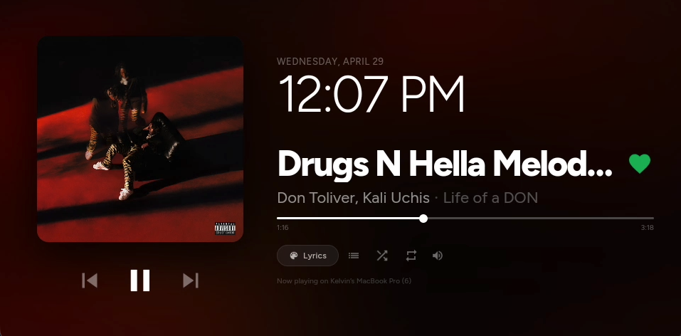
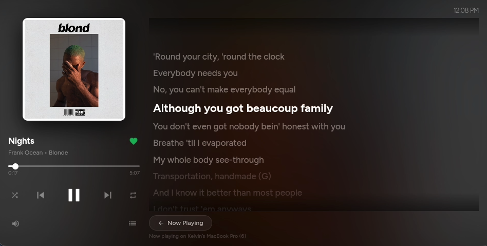

# 🎵 Echo Show Spotify Dashboard

A beautiful, real-time Spotify now-playing dashboard built for Amazon Echo Show devices — synced lyrics, liked songs, queue, shuffle, weather, and more. One HTML file. No backend. No subscription.

> **Transparency note:** This entire project was built through conversation with [Claude AI](https://claude.ai) (free tier) — I prompted it, directed it, debugged it, and made every design decision. I don't write JavaScript or CSS. That's the point. If you're a recruiter: this shows I know how to use AI as a tool effectively, identify problems, and ship a working product. That's a skill in itself.

---

## 📸 Screenshots

<p align="center">
  
  
</p>

<p align="center">
  <em>Now Playing page (left) &nbsp;·&nbsp; Lyrics page with synced scroll (right)</em>
</p>

<p align="center">
  
  
</p>

<p align="center">
  <em>Now Playing (left) &nbsp;·&nbsp; Synced lyrics view (right)</em>
</p>

---

## ✨ Features

- **Real-time playback** — polls Spotify's Web API every 1 second directly. No Home Assistant lag.
- **Synced lyrics** — fetched from [lrclib.net](https://lrclib.net) (free, no key). Active line auto-highlighted and centered.
- **Smart lyrics page** — stays on lyrics if next song has lyrics too. Auto-returns to Now Playing if none found. Toggle off with the back button.
- **Liked Songs sync** — heart auto-fills green if the song is in your Liked Songs. Tap to like or unlike. Checks every 10 seconds so changes from other devices reflect automatically.
- **Queue** — live Next Up list with artwork, pulled directly from Spotify.
- **Shuffle & Loop** — toggle from the dashboard. Synced with Spotify state.
- **Volume slider** — custom div-based (not a native `<input type="range">`) so it renders correctly on Fire OS.
- **Weather** — uses browser geolocation + [Open-Meteo](https://open-meteo.com) (free, no API key). Hides gracefully if location is denied.
- **Clock & date** — pure JS, no dependencies.
- **Touch support** — all scrubbers work with touch events for the Echo Show touchscreen.
- **Responsive queue** — adapts to any screen width.

---

## 🛠 How To Set This Up At Home

### What You Need

| Thing | Cost |
|---|---|
| Amazon Echo Show (any gen) | You already have it |
| Spotify account | Free or Premium |
| Spotify Developer App | Free |
| Somewhere to host one HTML file | Free (GitHub Pages works great) |
| [FreeKiosk](https://freekiosk.app/download/) | Free |

---

### Step 1 — Sideload Apps via ADB

Echo Shows run **Fire OS** (Android). You can install apps via **ADB (Android Debug Bridge)**.

Big shoutout to the Fire OS modding community for documenting this process.

**Tools:**
- **[ADB](https://developer.android.com/tools/adb)** — works on **Windows, macOS, and Linux**
- **[scrcpy](https://github.com/Genymobile/scrcpy)** — optional but great: mirrors and controls your Echo Show from your computer

**Enable ADB on your Echo Show:**
1. Settings → Device Options → Developer Options
2. Enable ADB

**Connect from your computer:**
```bash
adb connect <your-echo-show-ip>:5555
```

**Install FreeKiosk:**
```bash
adb install freekiosk.apk
```

---

### Step 2 — Set Up FreeKiosk

[FreeKiosk](https://freekiosk.app/download/) runs as a clean full-screen browser — no address bar, no notification banners, no UI chrome.

1. Sideload it via ADB
2. Point it at your dashboard URL
3. Enable "Disable status bar" so Spotify banners don't interrupt the display

> **Note:** The dashboard also works in Silk Browser (Fire OS's built-in browser). FreeKiosk just gives the cleanest kiosk experience.

---

### Step 3 — Create a Spotify Developer App

1. Go to [developer.spotify.com/dashboard](https://developer.spotify.com/dashboard)
2. Create an app
3. Copy your **Client ID** and **Client Secret**
4. Under **Redirect URIs**, add your dashboard URL (e.g. `https://yourname.github.io/echo-dashboard/dashboard.html`)
5. Enable **Web API** under APIs used
6. Add your Spotify email under **Users and Access** (required in Development mode)

---

### Step 4 — Edit the Dashboard

Open `dashboard.html` and update these lines near the top of the `<script>`:

```js
const SP_ID  = 'your-spotify-client-id';    // required
const SP_SEC = 'your-spotify-client-secret'; // required
```

> **Don't use Home Assistant?** Once you connect via Spotify OAuth (Step 5), everything routes through Spotify directly — play, pause, skip, seek, volume, shuffle, loop, queue, liked songs, lyrics. HA is optional.

---

### Step 5 — Host It

Host `dashboard.html` anywhere:

- **GitHub Pages** (free): push to a repo, enable Pages → `https://yourname.github.io/repo/dashboard.html`
- **Cloudflare Pages** (free): drag and drop
- **Your own domain**: just serve the static file

Then open it, click **Connect Spotify**, log in, and approve. Done — token is saved to `localStorage`.

---

### Do I Need My Own Domain?

**No.** GitHub Pages is free and works perfectly. If you want to use my hosted version, just swap in your own Spotify Client ID and Secret.

---

### Multi-Echo Show Sync

Spotify Connect means any device logged into your account sees the same playback state. Run this dashboard on multiple Echo Shows and they'll all stay in sync — same song, same position, same queue — updated every 1 second via direct Spotify API.

---

## 🚫 Do I Need Home Assistant?

**No.** HA was used in early development as a Spotify proxy, but everything now runs through the Spotify Web API directly after OAuth. HA is kept in the code as an optional fallback for basic controls if you haven't connected OAuth yet. You can ignore it entirely.

---

## 🙏 Credits & Tools

| | |
|---|---|
| **ADB** | [developer.android.com/tools/adb](https://developer.android.com/tools/adb) — sideload on Fire OS from Windows/macOS/Linux |
| **scrcpy** | [github.com/Genymobile/scrcpy](https://github.com/Genymobile/scrcpy) — mirror + control Echo Show from your computer |
| **FreeKiosk** | [freekiosk.app](https://freekiosk.app/download/) — full-screen kiosk browser for Echo Show |
| **lrclib.net** | Free synced lyrics API, no key needed |
| **Open-Meteo** | Free weather API, no key needed |
| **Spotify Web API** | [developer.spotify.com](https://developer.spotify.com/dashboard) |
| **Echo Show modding community** | For documenting ADB access and Fire OS sideloading |
| **Claude AI** | [claude.ai](https://claude.ai) — built this entire project through conversation (free tier) |

---

## 💬 On Using AI

I don't write JavaScript or CSS. This project was built entirely by prompting Claude AI, reviewing the output, catching bugs, making design calls, and directing what to build next. Every feature, fix, and decision went through me — Claude was the tool, I was the engineer.

I'm posting this publicly because:
1. It works really well and other Echo Show owners might want it
2. It's an honest example of what you can build with AI tools and clear thinking
3. I'd rather be transparent than have anyone think I have skills I don't

If you're a recruiter: I know how to identify a problem, use the right tool, iterate until it's right, and ship something real. That's what this is.

---

## 📄 License

MIT — use it, fork it, do whatever. A shoutout is appreciated but not required.
